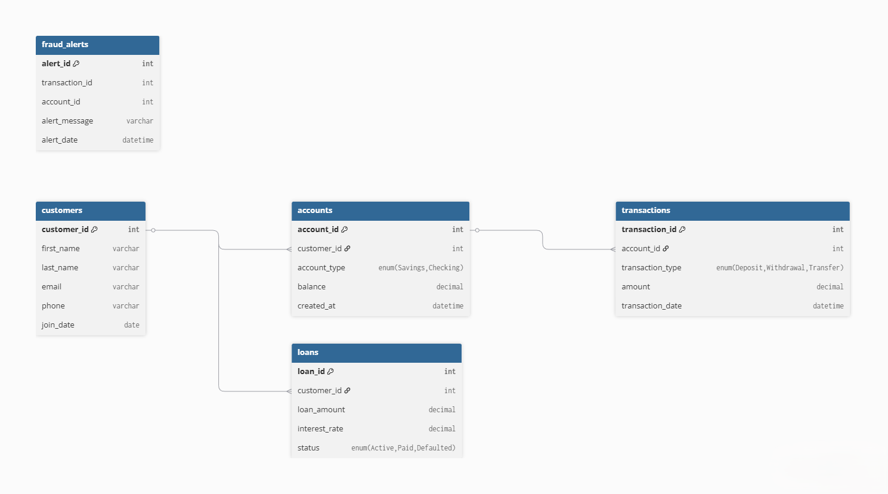

<div align="center">
  <a href="SQL_SCENARIOS.md">
    
  </a>
  <p><em>Click the banner to view the full analysis report</em></p>
</div>

# 🏦 Bank Vault Core: ACID Compliant Banking DB


## 📌 Overview
This project simulates a secure banking backend. Unlike standard analytics databases, this system focuses on **Data Integrity** and **Transactional Safety**. 

It features:
* **Stored Procedures** to handle money transfers safely.
* **Triggers** to automatically flag suspicious high-value transactions.
* **Normalized Schema** for customers, accounts, and loans.


---

## 🔐 The "Huge Plus": What is ACID?
In banking, you cannot afford to lose money due to a server crash. This project implements **ACID** properties using MySQL Transactions.

### A - Atomicity (All or Nothing)
* **Concept:** A transaction involves multiple steps (deduct money, add money, log it). If step 3 fails, steps 1 and 2 must be undone.
* **Implementation:** Inside `transfer_funds`, I use `START TRANSACTION`, `COMMIT`, and `ROLLBACK`. If funds are insufficient, the entire process is rolled back.

### C - Consistency (Rules are Followed)
* **Concept:** The database must remain in a valid state before and after the transaction.
* **Implementation:** Foreign Keys ensuring transactions are linked to real accounts; checks ensuring balances don't drop below allowed limits.

### I - Isolation (Don't Interfere)
* **Concept:** Two transfers happening at the exact same millisecond shouldn't corrupt the balance.
* **Implementation:** MySQL handles row-level locking during the `UPDATE` statements in the stored procedure.

### D - Durability (Saved Forever)
* **Concept:** Once `COMMIT` is executed, the data is saved to the disk even if the power goes out immediately after.

---

## 🛠️ Key Features Code
### 1. The Secure Transfer (Stored Procedure)
```sql
START TRANSACTION;
UPDATE accounts SET balance = balance - 500 WHERE id = 1;
UPDATE accounts SET balance = balance + 500 WHERE id = 2;
-- If any error happens here -> ROLLBACK
COMMIT;
```
### 2. Fraud Detection (Trigger)

Automated monitoring system that watches every `INSERT` into the transactions table.
```sql
IF NEW.amount > 10000 THEN
    INSERT INTO fraud_alerts ...
END IF;
```
---
📄 **[View Full Analysis Report](https://htmlpreview.github.io/?https://github.com/sanaurrehmanarain/Bank-Vault-Core-SQL/blob/main/SQL_SCENARIOS.md)**
---
🚀 How to Run

1. Create database `banking_system`.

2. Run `schema.sql` to build tables.

3. Run `logic.sql` to load procedures and triggers.

4. Run `analysis.sql` to simulate transfers and view reports.
