# 🏦 SQL Scenarios & Analysis Log

This document records the 20 analytical queries executed on the `banking_system` database.

---

### 1. View all customers

**Goal:** Retrieve customer list to verify data population.

```sql
SELECT * FROM customers LIMIT 10;
```

**Output:**

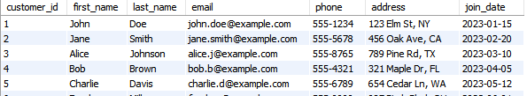

---

### 2. List all active checking accounts

**Goal:** Filter accounts by type and balance status.

```sql
SELECT * FROM accounts WHERE account_type = 'Checking' AND balance > 0;
```

**Output:**

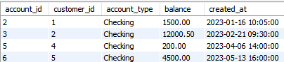

---

### 3. Total balance of Customer ID 1

**Goal:** Calculate the total wealth (Savings + Checking) for a specific user.

```sql
SELECT SUM(balance) AS total_wealth FROM accounts WHERE customer_id = 1;
```

**Output:**

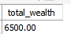

---

### 4. Transaction Count by Type

**Goal:** Analyze the volume of Deposits vs Withdrawals vs Transfers.

```sql
SELECT transaction_type, COUNT(*) FROM transactions GROUP BY transaction_type;
```

**Output:**

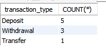

---

### 5. List Active Loans

**Goal:** View all loans that are currently outstanding.

```sql
SELECT * FROM loans WHERE status = 'Active';
```

**Output:**

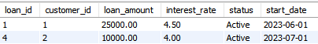

---

### 6. Customer Net Worth Report

**Goal:** Rank customers by their total deposited balance.

```sql
SELECT c.first_name, c.last_name, SUM(a.balance) as total_balance
FROM customers c
JOIN accounts a ON c.customer_id = a.customer_id
GROUP BY c.customer_id
ORDER BY total_balance DESC;
```

**Output:**

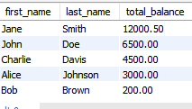

---

### 7. Customers with NO Accounts

**Goal:** Identify potential churn/leads (Customers registered but with no open accounts).

```sql
SELECT c.first_name, c.last_name
FROM customers c
LEFT JOIN accounts a ON c.customer_id = a.customer_id
WHERE a.account_id IS NULL;
```

**Output:**

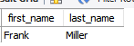

---

### 8. High-Interest Loans Report

**Goal:** Find risky loans with an interest rate higher than 5%.

```sql
SELECT c.first_name, l.loan_amount, l.interest_rate
FROM customers c
JOIN loans l ON c.customer_id = l.customer_id
WHERE l.interest_rate > 5.0;
```

**Output:**

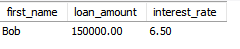

---

### 9. Daily Transaction Volume

**Goal:** Aggregate transaction counts and volume by date.

```sql
SELECT DATE(transaction_date) as date, COUNT(*) as num_trans, SUM(ABS(amount)) as volume
FROM transactions
GROUP BY DATE(transaction_date);
```

**Output:**

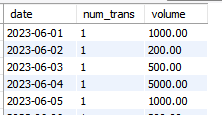

---

### 10. Average Loan Amount by Status

**Goal:** Compare average loan sizes for Active, Paid, and Defaulted loans.

```sql
SELECT status, ROUND(AVG(loan_amount), 2) as avg_loan
FROM loans
GROUP BY status;
```

**Output:**

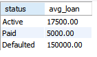

---

### 11. Stored Procedure Test (Success)

**Goal:** Transfer $500 from Account 1 to Account 2 using ACID transaction logic.

```sql
CALL transfer_funds(1, 2, 500.00);
```

**Output:**

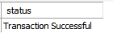

---

### 12. Stored Procedure Test (Rollback/Failure)

**Goal:** Attempt to transfer more money than available ($1,000,000) to verify ACID Rollback.

```sql
CALL transfer_funds(1, 2, 1000000.00);
```

**Output:**


---

### 13. Verify Balances

**Goal:** Check Account 1 and 2 to ensure the logic worked correctly (Money moved in #11, stayed put in #12).

```sql
SELECT account_id, balance FROM accounts WHERE account_id IN (1, 2);
```

**Output:**

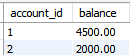

---

### 14. Trigger Test (Fraud Insert)

**Goal:** Manually insert a high-value transaction ($15,000) to trigger the fraud system.

```sql
INSERT INTO transactions (account_id, transaction_type, amount) 
VALUES (1, 'Withdrawal', 15000.00);
```

**Output:**

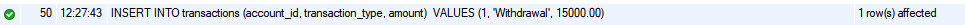

---

### 15. Check Fraud Alerts

**Goal:** Verify the trigger successfully logged the previous transaction in the fraud_alerts table.

```sql
SELECT * FROM fraud_alerts;
```

**Output:**

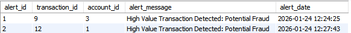

---

### 16. VIP Customers

**Goal:** Find customers with >$50k balance OR >$100k loans.

```sql
SELECT DISTINCT c.first_name, c.email
FROM customers c
JOIN accounts a ON c.customer_id = a.customer_id
LEFT JOIN loans l ON c.customer_id = l.customer_id
WHERE a.balance > 50000 OR l.loan_amount > 100000;
```

**Output:**

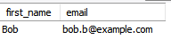

---

### 17. Individual Transaction History

**Goal:** Retrieve full history for Customer ID 1.

```sql
SELECT t.transaction_date, t.transaction_type, t.amount
FROM transactions t
JOIN accounts a ON t.account_id = a.account_id
WHERE a.customer_id = 1
ORDER BY t.transaction_date DESC;
```

**Output:**

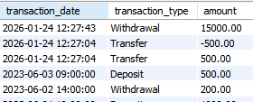

---

### 18. Bank Liquidity Report

**Goal:** Compare Total Deposits vs Total Outstanding Loans (Health Check).

```sql
SELECT 
    (SELECT SUM(balance) FROM accounts) AS total_deposits,
    (SELECT SUM(loan_amount) FROM loans WHERE status='Active') AS total_outstanding_loans;
```

**Output:**

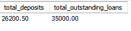

---

### 19. Defaulted Loans List

**Goal:** List customers who have defaulted on their loans.

```sql
SELECT c.first_name, c.last_name, l.loan_amount
FROM customers c
JOIN loans l ON c.customer_id = l.customer_id
WHERE l.status = 'Defaulted';
```

**Output:**

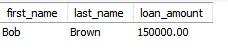

---

### 20. View: Account Summary

**Goal:** Select from the created View to show a simplified dashboard.

```sql
-- Ensure CREATE VIEW account_summary... was run first
SELECT * FROM account_summary LIMIT 5;
```

**Output:**

